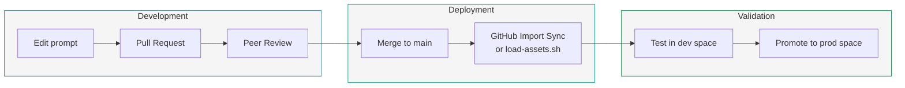

# Agent Prompt Versioning

## Strategy

All agent instructions, skills, and custom agent definitions are **version-controlled in Git** alongside the infrastructure code. This ensures:

- Every prompt change has an author, timestamp, and review (PR)
- Changes can be rolled back
- Multiple environments can use different prompt versions
- Audit trail for compliance

## Versioning Scheme

```
assets/instructions/AGENTS-global.md        → v1.2.0
assets/instructions/AGENTS-incident-rca.md  → v1.1.0
skills/ecs-deployment-investigation/SKILL.md → v2.0.0
```

We use **semantic versioning** for prompts:

| Change Type | Version Bump | Example |
|-------------|:------------:|---------|
| Fix typo, clarify wording | PATCH (x.x.+1) | "Add missing account ID" |
| Add new investigation step | MINOR (x.+1.0) | "Add Step 6: check DNS" |
| Rewrite approach, change behavior | MAJOR (+1.0.0) | "Switch from reactive to proactive" |

## File Header Convention

Every `AGENTS-*.md` and `SKILL.md` includes a version comment at the top:

```markdown
<!-- version: 1.2.0 | last-updated: 2026-08-05 | author: sre-team -->
# Agent Instructions — Global
...
```

## CHANGELOG

Track changes in this file. Format: `[version] - date - author - description`

### Global Instructions (AGENTS-global.md)

```
[1.0.0] - 2026-08-05 - platform-team - Initial version with org context, escalation, security
```

### Incident Triage (AGENTS-incident-triage.md)

```
[1.0.0] - 2026-08-05 - sre-team - Initial triage process, skip criteria, noise sources
```

### Incident RCA (AGENTS-incident-rca.md)

```
[1.0.0] - 2026-08-05 - sre-team - Initial RCA methodology, sources, output format
```

### Chat (AGENTS-chat.md)

```
[1.0.0] - 2026-08-05 - sre-team - Initial chat behavior, common queries, boundaries
```

### Skills

```
[ecs-deployment-investigation 1.0.0] - 2026-08-05 - Initial ECS failure procedures
[pipeline-failure-triage 1.0.0]      - 2026-08-05 - Initial pipeline triage procedures
[daily-health-report 1.0.0]          - 2026-08-05 - Initial daily health check
[skip-scheduled-maintenance 1.0.0]   - 2026-08-05 - Initial maintenance window filter
```

## Deployment Flow



## Multi-Environment Prompt Strategy

| Aspect | Dev Agent Space | Prod Agent Space |
|--------|:-:|:-:|
| Instructions source | `main` branch (latest) | Tagged release (e.g., `prompts-v1.2.0`) |
| Sync method | Auto-sync on push | Manual sync after validation |
| Experimental skills | ✅ Allowed (can be `INACTIVE`) | ❌ Only proven, `ACTIVE` skills |
| Custom agents | Test freely | Only after dev validation |

## Review Checklist for Prompt PRs

- [ ] Version bumped in file header comment
- [ ] CHANGELOG updated
- [ ] Description field >= 100 chars (skills only)
- [ ] No hardcoded secrets or real credentials
- [ ] Tested in dev Agent Space before promoting
- [ ] No conflicting instructions between global and agent-specific
- [ ] Size within limits (instructions: < 25 KB, skills: < 6 MB)
